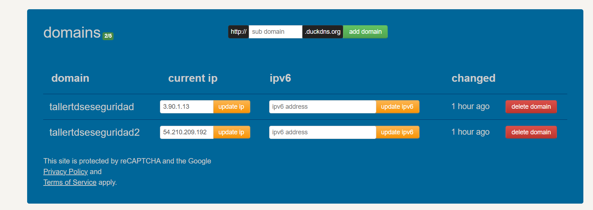
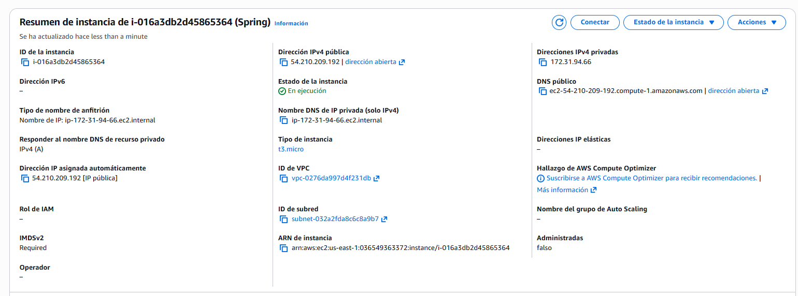
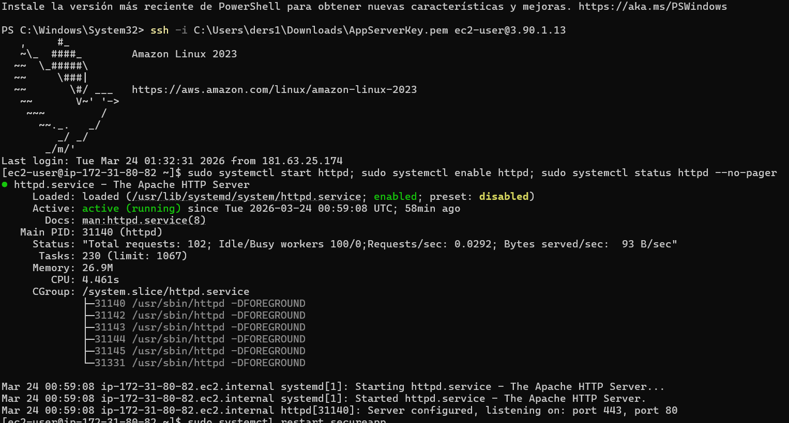
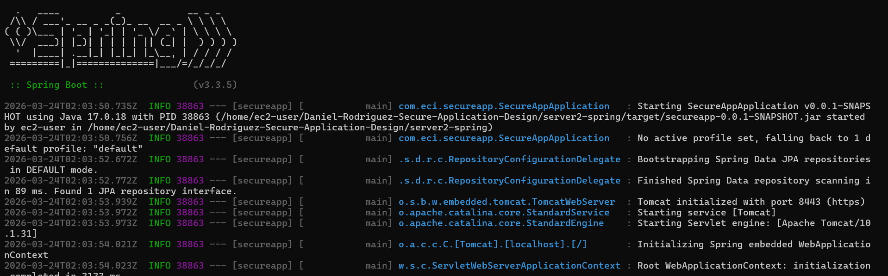
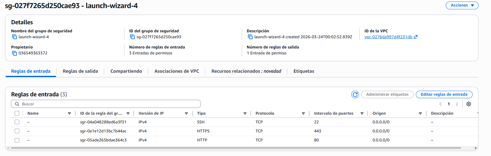
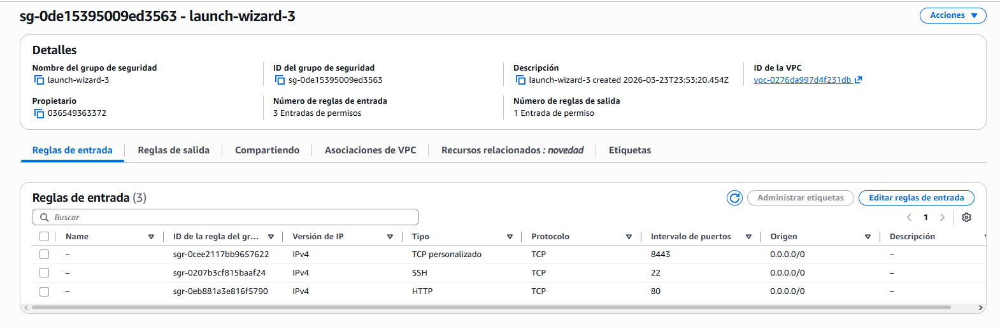
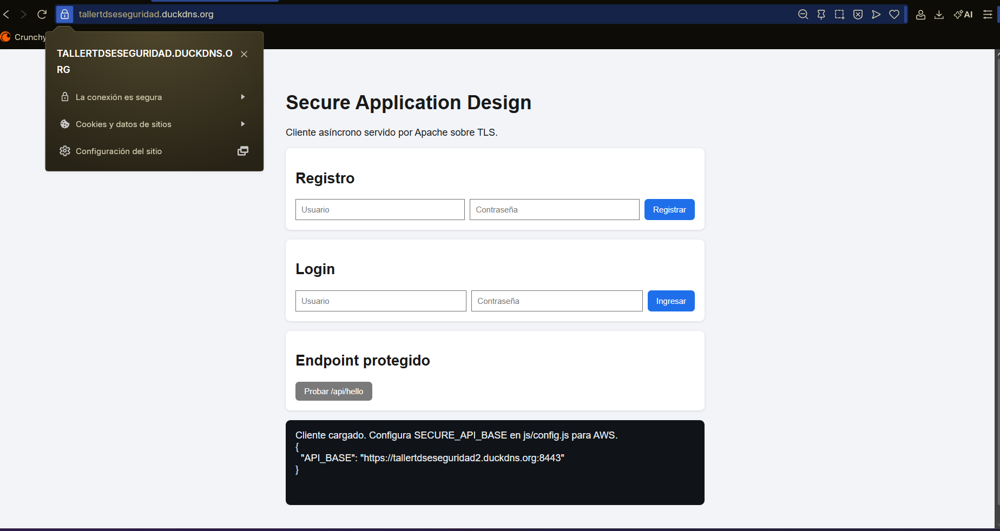
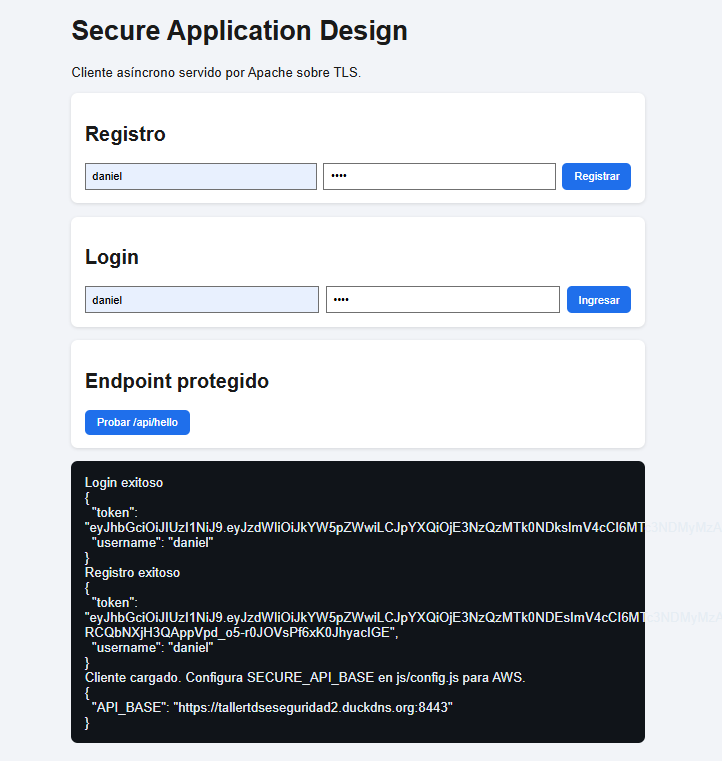
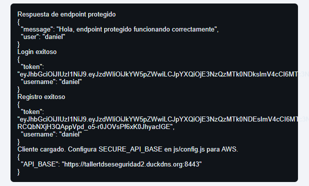

# Secure Application Design 

This repository contains a two-server secure application architecture using Apache, Spring Boot, HTTPS/TLS, and JWT-based authentication.

---

## Table of Contents

1. [Project Overview](#1-project-overview)
2. [Architecture](#2-architecture)
3. [Repository Structure](#3-repository-structure)
4. [Local Run (Quick Start)](#4-local-run-quick-start)
5. [AWS Run (Operational Summary)](#5-aws-run-operational-summary)
6. [Functional Validation Checklist](#6-functional-validation-checklist)
7. [Evidence Placeholders](#7-evidence-placeholders-insert-your-images-here)
8. [Video Presentation](#8-video-presentation)
9. [Technical Concepts Reference](#9-technical-concepts-reference)
   - [9.1 What is an API?](#91-what-is-an-api-application-programming-interface)
   - [9.2 What is an Endpoint?](#92-what-is-an-endpoint)
   - [9.3 What is JWT?](#93-what-is-jwt-json-web-token)
   - [9.4 What is BCrypt Hashing?](#94-what-is-bcrypt-hashing)
   - [9.5 What is TLS?](#95-what-is-tls-transport-layer-security)
   - [9.6 What is CORS?](#96-what-is-cors-cross-origin-resource-sharing)
   - [9.7 What is a Keystore?](#97-what-is-a-keystore)
   - [9.8 What is Stateless Authentication?](#98-what-is-stateless-authentication)
10. [Notes](#10-notes)
11. [Conclusions](#11-conclusions)
12. [Author](#12-author)

---

## 1) Project Overview
The solution is split into two independent servers:

- **Server 1 (Apache):** serves the asynchronous web client over HTTPS.
- **Server 2 (Spring Boot):** exposes the protected REST API over HTTPS.

Core security goals:

- End-to-end encryption with TLS certificates.
- Secure authentication flow (register + login).
- Password hashing with BCrypt.
- JWT-based access control for protected endpoints.
- Minimal network exposure in AWS.

## 2) Architecture

```text
Browser
  │
  ├── HTTPS :443 ───────────► Apache (EC2 #1)
  │                           Static client (HTML/CSS/JS)
  │
  └── HTTPS :8443 ──────────► Spring Boot (EC2 #2)
                              REST API + JWT + BCrypt
```

### Architecture Flow

1. User opens the Apache-hosted frontend via HTTPS.
2. Frontend sends async API requests to Spring Boot over HTTPS.
3. User registers/logs in through `/api/auth/*` endpoints.
4. Backend returns JWT token on successful authentication.
5. Frontend includes `Authorization: Bearer <token>` for protected routes.
6. `/api/hello` returns data only with a valid token.

## 3) Repository Structure

```text
.
├── server1-apache/
│   ├── public_html/
│   │   ├── index.html
│   │   ├── css/style.css
│   │   └── js/
│   │       ├── app.js
│   │       └── config.js
│   └── secureapp.conf
├── server2-spring/
│   ├── pom.xml
│   └── src/main/java/com/eci/secureapp/
│       ├── config/
│       ├── controller/
│       ├── dto/
│       ├── model/
│       ├── repository/
│       ├── security/
│       ├── service/
│       └── SecureAppApplication.java
├── scripts/
│   ├── deploy-aws.sh
│   ├── generate-keystore.sh
│   └── run-local-backend.ps1
└── .env.example
```

## 4) Local Run (Quick Start)

### Backend (Spring Boot)

From `server2-spring`:

```bash
mvn clean package
```

Run HTTPS locally (PowerShell):

```powershell
$env:SERVER_SSL_ENABLED="true"
$env:SERVER_PORT="8443"
$env:SSL_KEY_STORE="keystore.p12"
$env:SSL_KEY_STORE_PASSWORD="changeit"
$env:JWT_SECRET="REPLACE_WITH_A_LONG_SECRET_32_BYTES_MINIMUM"
$env:APP_ORIGINS="http://localhost:8080,https://localhost:8080"
java -jar target\secureapp-0.0.1-SNAPSHOT.jar
```

### Frontend (Apache-like static serving for local test)

From `server1-apache/public_html`:

```bash
python -m http.server 8080
```

Open:

- `http://localhost:8080`

Set local API target in `server1-apache/public_html/js/config.js`:

```js
window.SECURE_API_BASE = "https://localhost:8443";
```

## 5) AWS Run (Operational Summary)

### Apache Instance

```bash
sudo systemctl start httpd
sudo systemctl enable httpd
sudo systemctl status httpd --no-pager
```

### Spring Instance

```bash
sudo systemctl restart secureapp
sudo systemctl enable secureapp
sudo systemctl status secureapp -n 80 --no-pager
sudo ss -tulnp | grep 8443
```

### Public Health Check

From your PC:

```powershell
curl.exe -k -I https://tallertdseseguridad2.duckdns.org:8443/api/hello
```

Expected without token: `401` or `403`.

## 6) Functional Validation Checklist

- Register user via UI.
- Login user via UI.
- Receive JWT token.
- Call protected endpoint with token.
- Confirm successful response with authenticated username.

## 7) Evidence Placeholders (Insert Your Images Here)

Use these sections to paste screenshots for final delivery.

### 7.1 DuckDNS Configuration



### 7.2 AWS EC2 Instances (Apache + Spring)




### 7.3 Apache HTTPS Running



### 7.4 Spring Service Running on 8443



### 7.5 Security Group Rules (443 / 8443)





### 7.6 TLS Certificate Evidence (Let's Encrypt)



### 7.7 Visual Register/Login Success



### 7.8 Protected Endpoint Success (`/api/hello`)



## 8) Video Presentation

Insert your demonstration video here. The video should cover:

- Application overview and architecture.
- Local / AWS deployment steps.
- Registration and login flow.
- Protected endpoint access with JWT.
- Security features (HTTPS, password hashing, token-based access).

**Video Link / Embedding:**


---

## 9) Technical Concepts Reference

This project demonstrates several fundamental cloud and web security concepts:

### 9.1 What is an API (Application Programming Interface)?

An **API** is a set of rules and protocols that allows different software applications to communicate with each other. In this project:

- The Spring Boot backend **exposes an API** (endpoints).
- The Apache frontend **consumes the API** via HTTP requests.
- APIs allow frontend and backend to remain independent and scalable.

**Example Endpoints in This Project:**
- `POST /api/auth/register` — Create a new user account.
- `POST /api/auth/login` — Authenticate and receive a token.
- `GET /api/hello` — Access protected data (requires authentication).

### 9.2 What is an Endpoint?

An **endpoint** is a specific URL route in an API that performs a particular action. Each endpoint:

- Has a **path** (e.g., `/api/hello`).
- Has a **method** (GET, POST, PUT, DELETE).
- Accepts optional **parameters** and **headers**.
- Returns a **response** (usually JSON).

**Example:**
```text
POST /api/auth/login
Headers: Content-Type: application/json
Body: {"username":"daniel","password":"Demo123!"}
Response: {"token":"eyJ...","username":"daniel"}
```

### 9.3 What is JWT (JSON Web Token)?

**JWT** is a secure method of transmitting identity and authorization information between the client and server:

- **Structure:** Header.Payload.Signature (three Base64 parts).
- **Flow:**
  1. User logs in → server generates token.
  2. Client stores token in memory/localStorage.
  3. Client includes token in `Authorization` header for each request.
  4. Server validates token before granting access.

**Security Benefit:** Stateless authentication without session storage.

### 9.4 What is BCrypt Hashing?

**BCrypt** is a password hashing algorithm that:

- Converts plain passwords into irreversible hashes.
- Adds a computational cost (slow) to prevent brute-force attacks.
- Stores only the hash, never the original password.

**Example in This Project:**
```
Plain password:  "Demo123!"
BCrypt hash:     "$2a$10$DJdjN9j2...kP/2k8vE9uK"
(Stored in database, never the plain text)
```

### 9.5 What is TLS (Transport Layer Security)?

**TLS** (often called SSL) is the protocol that encrypts data in transit:

- **HTTPS** = HTTP + TLS.
- All data between client and server is encrypted.
- **Certificate** proves the server's identity (Let's Encrypt in this project).
- Prevents eavesdropping and man-in-the-middle attacks.

**Visible in Project:**
- Frontend: `https://tallertdseseguridad.duckdns.org` (port 443).
- Backend: `https://tallertdseseguridad2.duckdns.org:8443` (port 8443).
- Padlock icon in browser confirms secure connection.

### 9.6 What is CORS (Cross-Origin Resource Sharing)?

**CORS** controls which web pages can access an API:

- Frontend at `https://domain1.com` cannot directly call API at `https://domain2.com` without permission.
- Server explicitly allows certain origins via `APP_ORIGINS` configuration.

**In This Project:**
```
APP_ORIGINS=https://tallertdseseguridad.duckdns.org
(Allows frontend domain to call backend API)
```

### 9.7 What is a Keystore?

A **keystore** is a secure file containing:

- Private key (kept secret, used to sign responses).
- Public certificate (shared, proves identity).

**In This Project:**
- Located at `/home/ec2-user/keystore.p12` on EC2.
- Format: PKCS12 (industry standard).
- Password-protected.
- Spring Boot uses it to enable HTTPS on port 8443.

### 9.8 What is Stateless Authentication?

**Stateless** means the server does NOT store user session data:

- Server generates a token (JWT) and sends it to client.
- Client stores token and includes it in every request.
- Server validates token without checking a session database.
- **Benefit:** Scales easily to multiple servers.

---

## 10) Notes

- If the UI shows `Failed to fetch`, verify backend reachability (`secureapp` status, port `8443`, DNS, and security group).
- If `/api/hello` returns `403` without token, that is expected behavior.
- Keep frontend `SECURE_API_BASE` aligned with the environment:
  - Local: `https://localhost:8443`
  - AWS: `https://tallertdseseguridad2.duckdns.org:8443`

---

## 11) Conclusions

This project demonstrates a **production-grade, secure two-tier architecture** that integrates multiple modern security and cloud concepts:

### Key Achievements

1. **End-to-End Encryption (HTTPS/TLS)**
   - Both frontend and backend communicate over encrypted channels.
   - Let's Encrypt certificates prove identity and prevent man-in-the-middle attacks.
   - Users can verify security via the browser padlock icon.

2. **Stateless JWT Authentication**
   - Secure, scalable token-based authentication without server-side sessions.
   - Tokens are cryptographically signed and cannot be forged.
   - Simplifies horizontal scaling across multiple backend servers.

3. **Password Security with BCrypt**
   - Passwords are never stored in plain text.
   - BCrypt's computational cost prevents brute-force attacks effectively.
   - Even if the database is compromised, passwords remain protected.

4. **Role-Based Access Control**
   - Protected endpoints (`/api/hello`) enforce authentication.
   - Clients without valid tokens receive `403 Forbidden` (as expected).
   - Clear separation between public and protected resources.

5. **Cloud Deployment Best Practices**
   - Minimal security group rules (only necessary ports exposed).
   - Separate servers for frontend and backend (security isolation).
   - Automated service startup and recovery via systemd.
   - Domain-based routing with DuckDNS for dynamic IP management.

### Real-World Applicability

This architecture is suitable for:

- **Multi-tenant SaaS applications** (easily scaled horizontally).
- **Mobile app backends** (lightweight, stateless tokens via JSON).
- **Microservices ecosystems** (independent frontend/backend teamwork).
- **Compliance-driven projects** (HTTPS by default, audit-trail capable).

### Lessons Learned

- **Security is layered:** TLS + JWT + BCrypt + CORS + network isolation = defense in depth.
- **Operational discipline matters:** Certificate renewal, secret rotation, dependency updates are ongoing tasks.
- **Testing at scale:** Local validation is insufficient; AWS deployment reveals infrastructure issues (DNS, SG, port conflicts, file permissions).
- **Documentation is crucial:** Clear architecture diagrams, endpoint specs, and deployment runbooks accelerate team onboarding.

### Next Steps for Production Readiness

1. **Monitoring & Logging:**
   - Collect logs from both Apache and Spring (centralized logging with ELK or CloudWatch).
   - Set up alerts for authentication failures, certificate expiration, downtime.

2. **Certificate Automation:**
   - Set up certbot renewal cron job to auto-refresh Let's Encrypt certificates before expiration.
   - Monitor renewal status.

3. **Database Hardening:**
   - Migrate from in-memory H2 to persistent database (PostgreSQL / RDS).
   - Enable encryption at rest and in transit.
   - Implement database backups and disaster recovery.

4. **Rate Limiting & DDoS Protection:**
   - Add rate limiting to `/api/auth/login` to prevent credential stuffing.
   - Use AWS WAF for DDoS mitigation.

5. **Code & Dependency Security:**
   - Regularly scan dependencies for vulnerabilities (OWASP Dependency-Check).
   - Perform penetration testing before production launch.

This project provides a solid foundation for secure, scalable web applications in modern cloud environments.

---

## 12) Author

Daniel Esteban Rodriguez Suarez / TDSE — ECI
