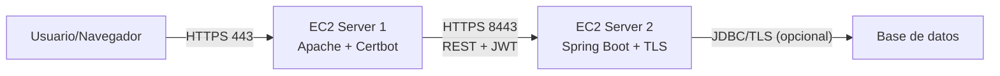

# Arquitectura de Aplicación Segura en AWS

## 1) Objetivo
Diseñar y desplegar una aplicación web segura y escalable con dos servidores separados en AWS:

- **Server 1 (Apache):** entrega cliente HTML + JavaScript asíncrono por HTTPS.
- **Server 2 (Spring Boot):** expone servicios REST por HTTPS.

Se priorizan buenas prácticas de seguridad: TLS extremo a extremo, autenticación con contraseñas hasheadas y despliegue con segmentación de red.

---

## 2) Vista de alto nivel

### Flujo funcional
1. El navegador carga `index.html`, `app.js`, `style.css` desde Apache por TLS.
2. El cliente asíncrono usa `fetch` para llamar APIs de Spring por TLS.
3. En login, Spring valida credenciales y compara hash de contraseña (BCrypt).
4. Spring entrega token (por ejemplo JWT) para consumir endpoints protegidos.

---

## 3) Componentes y responsabilidades

## 3.1 Server 1 — Apache
- Publicación de archivos estáticos del cliente.
- Terminación TLS con certificado de Let’s Encrypt.
- Redirección HTTP→HTTPS.
- Encabezados de seguridad recomendados:
  - `Strict-Transport-Security`
  - `X-Content-Type-Options`
  - `X-Frame-Options`
  - `Referrer-Policy`

## 3.2 Cliente asíncrono (HTML + JavaScript)
- Render de UI y lógica de interacción.
- Llamadas asíncronas (`fetch`/`async-await`) al backend.
- Manejo de token en memoria de sesión del cliente (evitando exponer credenciales en código).
- Validación básica de formularios (complementaria, no sustitutiva del backend).

## 3.3 Server 2 — Spring Boot
- API REST de autenticación y negocio.
- Seguridad con Spring Security.
- Hash de contraseñas con BCrypt (nunca guardar texto plano).
- Configuración TLS para puerto seguro de la API.
- CORS restringido al dominio del Apache.

---

## 4) Topología de red AWS recomendada

- **VPC** con al menos dos subredes públicas (para laboratorio simple).
- **Security Group Apache (SG-Apache):**
  - Inbound: `22` (SSH restringido), `80` (validación ACME y redirección), `443`.
  - Outbound: permitir tráfico hacia Server 2 en `8443`.
- **Security Group Spring (SG-Spring):**
  - Inbound: `22` (SSH restringido), `8443` **solo desde SG-Apache**.
  - Outbound: internet o recursos requeridos.

> Para producción real, ubicar el backend en subred privada y usar ALB/NLB según requerimientos.

---

## 5) Modelo de seguridad aplicado

## 5.1 Confidencialidad e integridad
- TLS en ambos tramos:
  - Navegador ↔ Apache (443)
  - Cliente JS ↔ Spring (8443)

## 5.2 Gestión de credenciales
- Contraseñas almacenadas con BCrypt + salt.
- Secretos (JWT, passwords, keystore) en variables de entorno o AWS Secrets Manager.

## 5.3 Principio de mínimo privilegio
- Apertura mínima de puertos.
- Restricción de origen para acceso a backend.
- Usuario de sistema no privilegiado para ejecutar servicios.

## 5.4 Hardening básico
- Deshabilitar directorios listables en Apache.
- Mantener paquetes del SO actualizados.
- Logs de Apache y Spring habilitados para auditoría.

---

## 6) API mínima sugerida para el taller

- `POST /api/auth/register` — registro con hash de contraseña.
- `POST /api/auth/login` — autenticación y emisión de token.
- `GET /api/hello` — endpoint protegido para validación del flujo.

---

## 7) Evidencia técnica esperada

- Capturas de candado HTTPS para Apache y Spring.
- Prueba de login exitoso y acceso a endpoint protegido.
- Extracto (o captura) de almacenamiento de contraseñas hasheadas.
- Evidencia de reglas en Security Groups.
- Diagrama final de arquitectura y explicación del flujo.

---

## 8) Riesgos comunes y mitigaciones

- **Riesgo:** backend expuesto públicamente sin restricción.
  - **Mitigación:** permitir `8443` únicamente desde SG-Apache.
- **Riesgo:** certificados expirados.
  - **Mitigación:** automatizar renovación con `certbot renew` + timer/cron.
- **Riesgo:** CORS abierto (`*`).
  - **Mitigación:** definir origin exacto del Apache.
- **Riesgo:** secretos en repositorio.
  - **Mitigación:** `.gitignore` + variables de entorno + gestor de secretos.
